# 프로젝트 첫 푸쉬 전에 git config를 수행해주세요

```
# 프로젝트 첫 푸쉬 전에 git config를 수행해주세요
git config user.name "홍길동"
git config user.email "hkd@gmail.com"
```

# Git 커밋 메세지 컨벤션

```
Feat : ✨ 새로운 기능 추가
Fix : 🐛 버그 수정 
Docs : 📚 문서 수정
Chore : 📝 그 외 자잘한 작업
Test : ☔️ 테스트 코드
Build : 🏹 시스템 또는 외부 종속성에 영향을 미치는 변경사항 (npm, gulp, yarn 레벨)
CI : 🎡 CI관련 설정
Style : 🎨 코드 의미에 영향을 주지 않는 변경사항 (포맷, 세미콜론 누락, 공백 등)
Refactor : 💡 성능 개선
Merge : 🤝 기능 개발 후 브랜치 병합
Docker : 🐳 도커 구성
DB : 🐬 MySQL 데이터베이스 특정 (마이그레이션, 스크립트, 확장 등)
Study : 📖 공부
```


# ParaSOL

BaaS 플랫폼 구축을 위한 API 서버 설계/구축

## 팀 소개

> 자율 프로젝트 기업연계반 1팀

- 김나경
- 김형준
- 선민기
- 연진우
- 오나연
- 조항준

<br>

## 기획 의도 및 배경

- 인터넷 전문 은행의 코어뱅킹 시스템과 연계하기 위한 표준화된 Rest API 서버를 제공함으로써 여러 외부 핀테크 업체와의 제휴서비스를 제공
- 계정계 메인 시스템과 Frontend를 Decoupling 하여 다양한 형태의 모바일 App을 구현, 고객에게 제공하기 위한 환경을 제공
- BaaS란 Banking as a Service를 말함

<br>

## 프로젝트 목표

- 뱅킹서비스 제공에 필요한 기능별로 API 목록화하여 정의하고 해당 목록별 API 서버 서비스를 구현
- API 호출 시 적용 가능한 모든 보안 기능을 검토하여 구현
- 각종 홍보 이벤트 및 거래 Peak 일을 감안하여 Transaction을 효율적으로 소화할 수 있는 아키텍쳐를 설계 및 구축

<br>

## 기술 스택

### 🌏 환경 버전

- 형상관리
  - Jira
  - GitLab
  - Mattermost
  - Webex
  - Notion
  - Google Docs
- 개발 환경
  - Windows 11 10.0
  - VSCode [버전]
  - Linter는 Prettier 사용 (기본값)

### ⛏ 기술 스택

- Backend

  - Java 1.8.0_192
  - Python 3.9.7
  - Intellij

  JetBrains Client 2021.3 Build #JBC-213.7172.25, built on March 16, 2022 Runtime version: 11.0.14.1+1-b1751.46 amd64 VM: OpenJDK 64-Bit Server VM by JetBrains s.r.o. Code With Me상의 게스트 GC: G1 Young Generation, G1 Old Generation Memory: 1500M Cores: 6 Registry: rdclient.backend.actionHandlers=false

  Non-Bundled Plugins: com.intellij.ko (213.341)

- Frontend

  - React JS
  - TypeScript
  - HTML5, CSS
  - Node.js 16.13.0
  - React Native
  - Expo

- DevOps

<br>

## 🤙 컨벤션

### JIRA

- Epic은 행동 단위 명사
- 기본 8~10시간, 주당 40시간
  - 스프린트 시작 전에 그 주의 일정을 보고 조율
- Task 명은 Git Commit Message와 동일 (Emoji만 제외)
- 월요일 17시에 다음 스프린트로 넘어갑니다.

### GIT

> Git Branch 컨벤션

```
master
develop
release
hotfix
feature/frontend/기능명
feature/backend/기능명
```

> Git Commit 메세지 컨벤션 & 템플릿

- 스페이스 주의
- 이모지 추가해주세요
- 백프론트 구분 가능한 커밋은 [FE/BE] 넣어주세요

```
Feat : :sparkles: 새로운 기능 추가
Fix : :bug: 버그 수정
Docs : :books: 문서 수정
Chore : :pencil: 그 외 자잘한 작업
Test : ☔️ 테스트 코드
Build : :bow_and_arrow: 시스템 또는 외부 종속성에 영향을 미치는 변경사항 (npm, gulp, yarn 레벨)
CI : :ferris_wheel: CI관련 설정
Style : :art: 코드 의미에 영향을 주지 않는 변경사항 (포맷, 세미콜론 누락, 공백 등)
Refactor : :bulb: 성능 개선
Merge : :handshake: 기능 개발 후 브랜치 병합
Docker : :whale: 도커 구성
DB : :dolphin: MySQL 데이터베이스 특정 (마이그레이션, 스크립트, 확장 등)
Study : :book: 공부
Settings : :gear: 환경설정
Design : :pencil: 기획
```

### 스크럼 회의

- 오전에는 일정 끝나고 조례 미팅 후 5분 이내로 디코로 모여 팀 미팅 15분 내로 반드시 종료
- 팀장 회의 끝나고 전달사항 있으면 간단하게 미팅
- 오후에는 반별 종례 미팅 후 5분 이내로 Jira 등 테스크 정리하고 15분 내로 반드시 종료

### 네이밍

```
1. 함수명:
  - Frontend: PascalCase 사용, 동사 형태 Create()
  - Backend: camelCase 사용, 동사 형태 Create()
2. URI: kebab-case 사용 /kebab-eat
3. 코드 내 변수명: camelCase 사용 const goodAfterNoon = AftetNoon()
4. DB 컬럼명: snake_case 사용 user_id
5. 구조체명, 클래스명: PascalCase 사용 class AfterNoon { }
6. 클래스 멤버 변수명: camelCase 사용 private string description
7. 인수 변수명: camelCase Create(int userId)
8. 인터페이스 명: I + PascalCase 사용 interface IGreatBread { }
9. 열거형 객체명: E + PascalCase 사용 enum EGreatBread { }
10. JAVA 패키지명: snake_case 사용
```

<br>

## 프로젝트 구성도

### 아키텍처

> 서버


> MSA


### [📂 와이어 프레임](https://www.figma.com/file/AojpGMxBn5gG9AP9ntbfTF/ParaSOL?node-id=157%3A2379)

### [📝 명세서 작성](https://docs.google.com/spreadsheets/d/1EJGdwgTLKDMG2TD3CdbwNqSU4w2ebX2s2LZdYw5q3yg/edit?usp=sharing)

### Gateway


<br>

## 구현 기능

- 각종 뱅킹서비스를 제공할 수 있는 거래 별 API 구현
  - 인증(로그인, 2차인증 등)
  - 계좌 목록 조회
  - 계좌 잔액 조회
  - 계좌 거래내역 조회
  - 입/지금 실행 - 각종 페이 충전에 대응
- OAuth 2.0 등 표준을 이용한 SNS 및 플랫폼 계정 인증 구현
- API 기능별 단위 테스트를 위한 프론트 엔드 구현
- API 서버는 AWS 등 클라우드 환경에 구축하여 컨테이너를 활용한 MSA 구축
- 일부 레거시 시스템 연계를 위한 Gateway 구현
- 대량 트랜잭션 발생 시 소화 가능한 아키텍쳐 설계 아이디어 제시
  - AWS 등 클라우드 환경의 기능 활용
  - Kubenete 등 컨테이너 관리 플랫폼 등 활용
- 부정 Access, 침해 방지 등 정보보호관점 설계 아이디어 제시

### 📟 Web Dashboard

**서비스 소개**

- 뱅킹 서비스 제공에 필요한 기능별로 API를 목록화하여 정의하고 구현
- API 기능별 단위 테스트를 위한 웹 대시보드
- Swagger, Postman을 모티브로 하여 레이아웃 및 디자인 설계
- API 개발 완료 여부, HTTP method, 기능명, URI 등 Rest API의 정보에 대해 쉽게 알아볼 수 있음
- 입력, 출력값과 응답 코드를 표시
- 사용자가 직접 입력하는 값과 자동으로 입력되는 값(ex. header token)을 구분

**기술 스택**

- React JS
- HTML5/CSS
- Axios
- styled components
- Material UI

**주요 기능**

> 기능 별 API 목록 분류

- 유저, 계좌, 인증 및 페이 탭

|  |  |
| ----------------------------------------------------- | ----------------------------------------------------- |


> 입력값, 출력값 확인

- 사용자가 직접 입력하는 데이터는 활성화
- default로 입력되는 데이터는 비활성화(ex. jwt token header)

|  |  |  |
| ----------------------------------------------------- | ----------------------------------------------------- | ----------------------------------------------------- |

|  |  |
| ----------------------------------------------------- | ----------------------------------------------------- |

### 📱 Mobile App

**서비스 소개**

- ParaSOL 앱은 코어뱅킹 시스템과 연계하기 위한 표준 RestAPI 서버가 제공되는 프로토타입의 모바일 앱
- React Native를 이용하여 구현한 반응형 모바일 어플리케이션
- 인증된 사용자 기반 서비스 제공
- Google OAuth 인증 지원

**기술 스택**

- React Native
- Expo
- HTML5/CSS
- Axios
- styled components

**주요 기능**

> 인증된 사용자 기반 서비스

- 로그인, 회원가입, 비밀번호 재설정


- 회원정보, 비밀번호 수정, 회원탈퇴

| 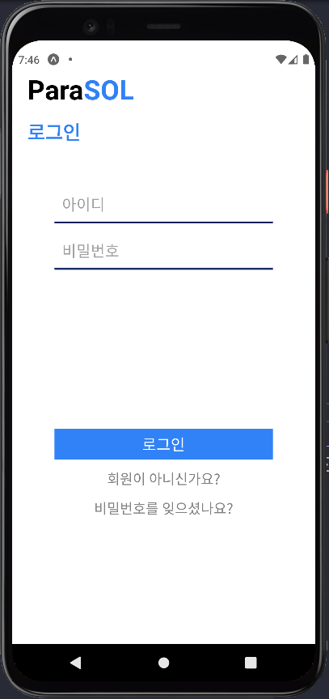 |  | 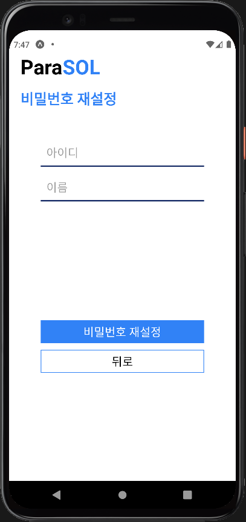 |
| ------------------------------------------------------ | ------------------------------------------------------ | ------------------------------------------------------ |
| 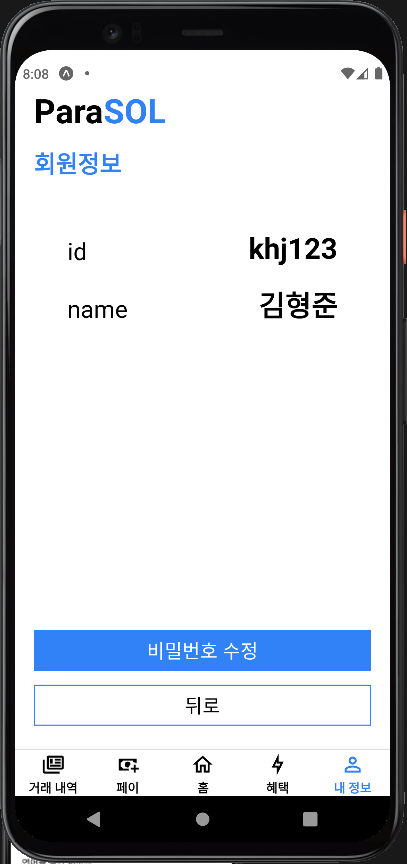 | 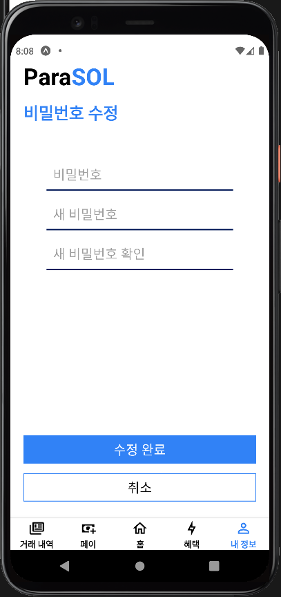 | 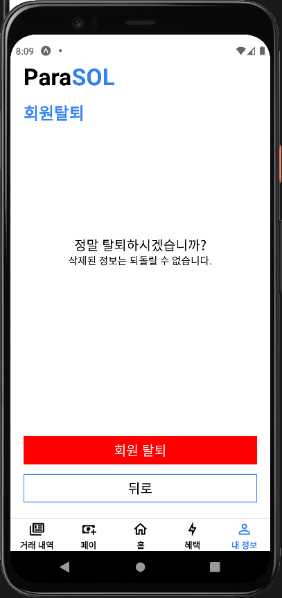 |

> OAuth 2.0

- 구글 OAuth 로그인

> 계좌 조회

- 월 별로 잔액 조회, 거래내역 조회
- 계좌 연결

| 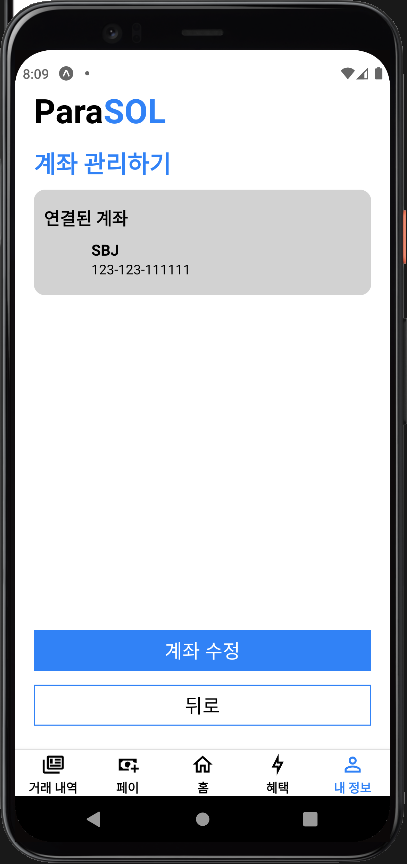 | 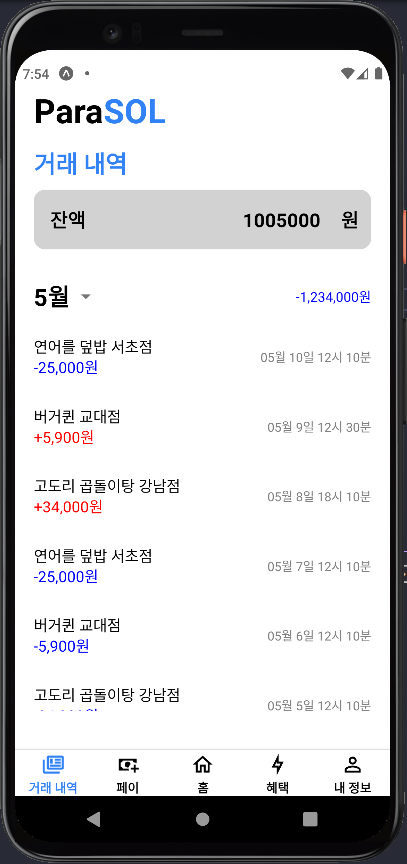 |  |
| ------------------------------------------------------ | ------------------------------------------------------ | ------------------------------------------------------ |

> 페이

- 연결된 계좌에 충전
- 연결된 계좌에서 출금

| 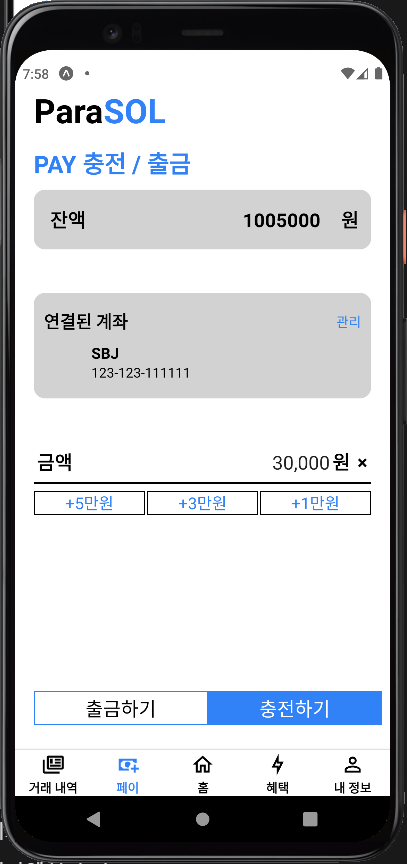 |  | 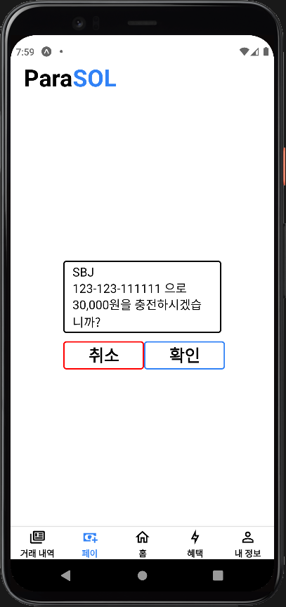 |
| ------------------------------------------------------ | ------------------------------------------------------ | ------------------------------------------------------ |

> 송금

- 입력된 계좌로 송금
- QR 스캐너로 계좌 정보 입력

|  | 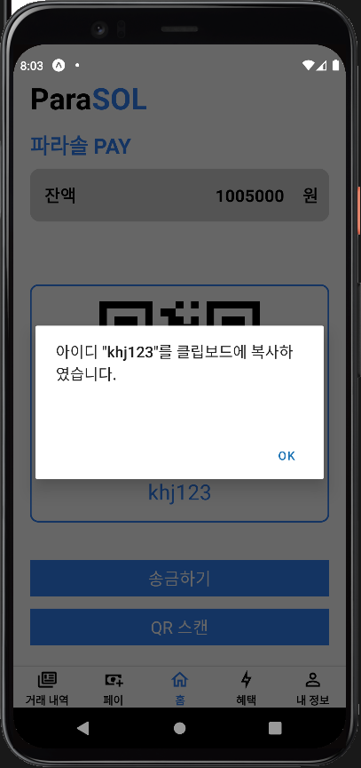 |
| ------------------------------------------------------ | ------------------------------------------------------ |
|  | 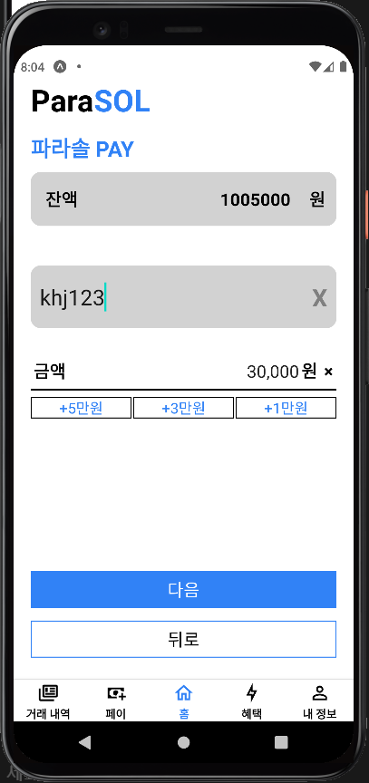 |

> 혜택

- 이벤트 목록 출력

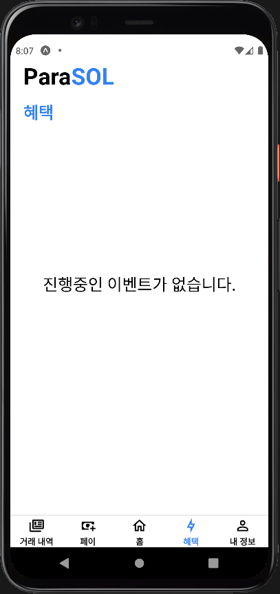

> 2차인증

- 생체 인증 - 지문 인식
- 공인 인증 - OTP

