# ParaSOL APP

## 서비스 소개

- ParaSOL 앱은 코어뱅킹 시스템과 연계하기 위한 표준 RestAPI 서버가 제공되는 프로토타입의 모바일 앱
- React Native를 이용하여 구현한 반응형 모바일 어플리케이션
- 인증된 사용자 기반 서비스 제공
- Google OAuth 인증 지원

<br>

## 기술 스택

- React Native
- Expo
- HTML5/CSS
- Axios
- styled components

<br>

## 빌드

- node pacakge manager 설치 - [Node.js](https://nodejs.org/ko/)

```bash
# npm 버전 확인
node -v

# npm 버전 확인
npm -v

# 패키지 라이브러리 설치
npm install
```

- expo 설치 및 실행

```shell
# expo 설치
npm install -g expo-cli

# expo 앱 실행
expo start
```

<br>

## 주요 기능

**인증된 사용자 기반 서비스**

- 로그인, 회원가입, 비밀번호 재설정
- 회원정보, 비밀번호 수정, 회원탈퇴

| 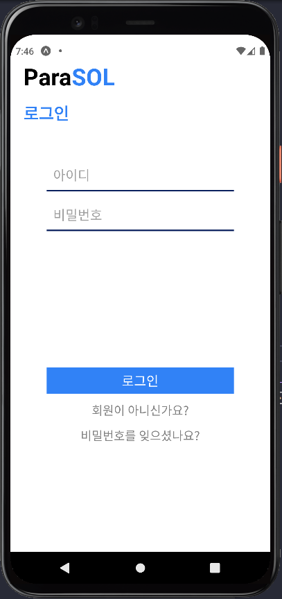 | 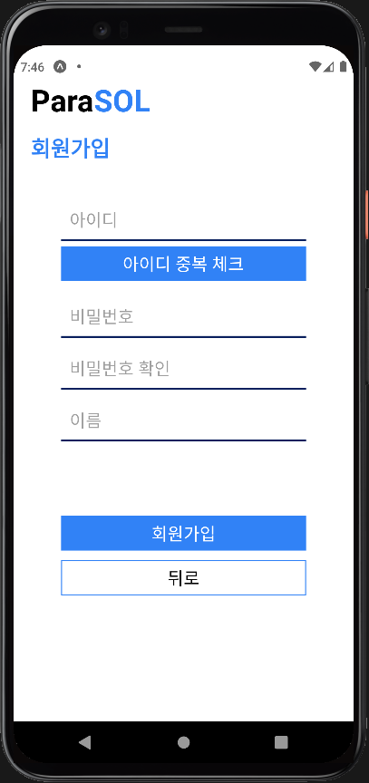 | 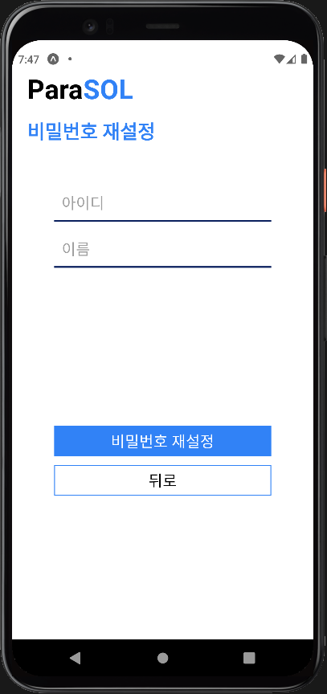 |
| ------------------------------------------------------------ | ------------------------------------------------------------ | ------------------------------------------------------------ |
| 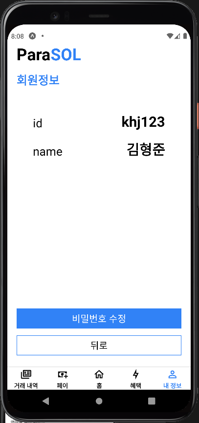 | 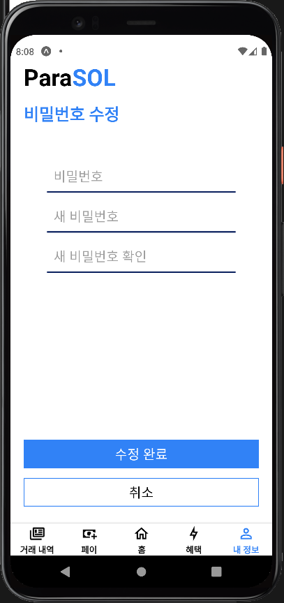 | 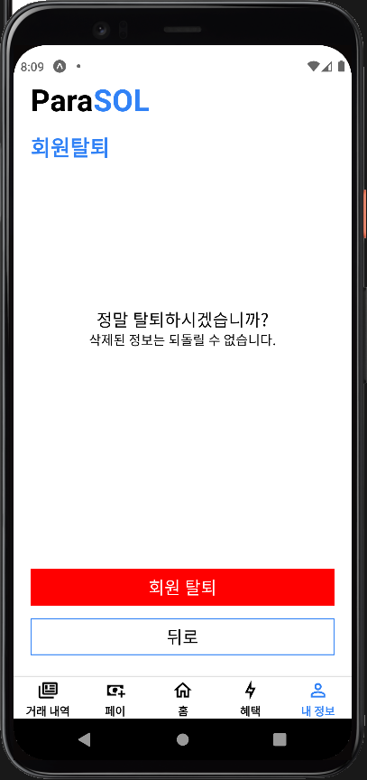 |


**OAuth 2.0**

- 구글 OAuth 로그인

**계좌 조회**

- 월 별로 잔액 조회, 거래내역 조회
- 계좌 연결

| 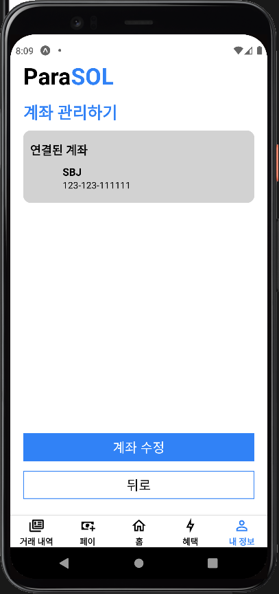 | 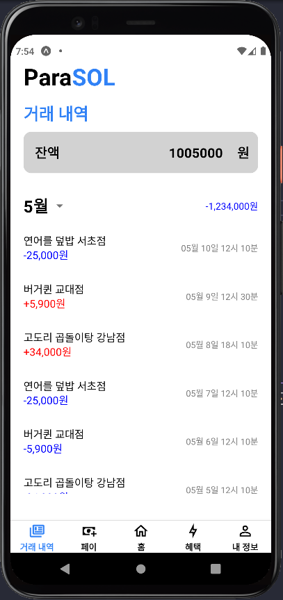 | 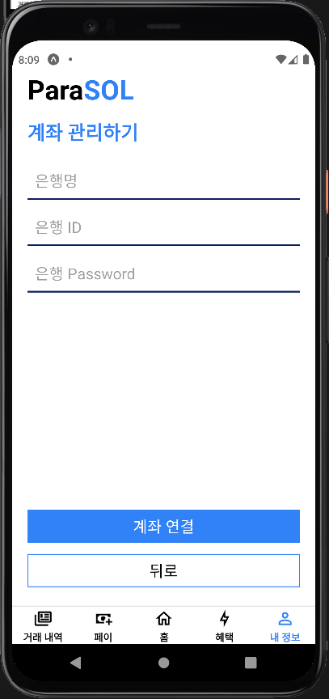 |
| ------------------------------------------------------------ | ------------------------------------------------------------ | ------------------------------------------------------------ |

**페이**

- 연결된 계좌에 충전
- 연결된 계좌에서 출금

| 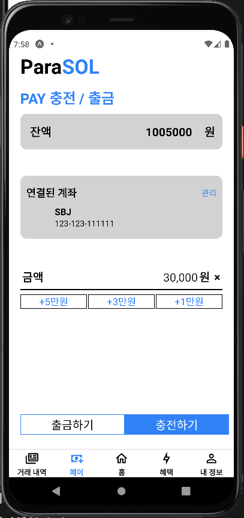 |  | 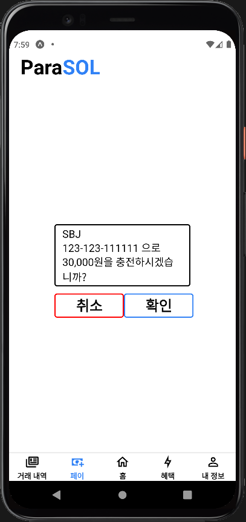 |
| ------------------------------------------------------------ | ------------------------------------------------------------ | ------------------------------------------------------------ |

**송금**

- 입력된 계좌로 송금
- QR 스캐너로 계좌 정보 입력

| 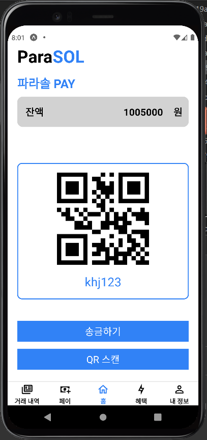 | 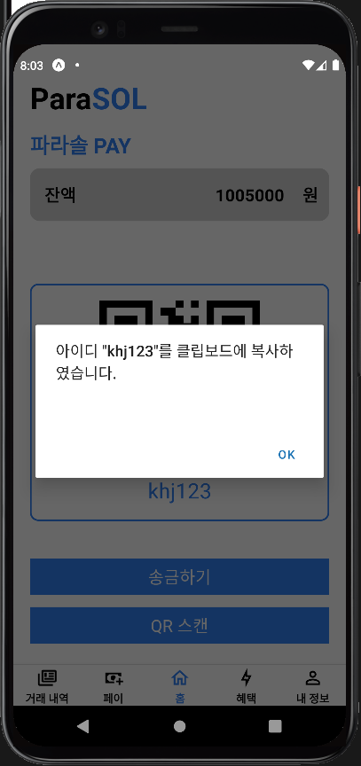 |
| ------------------------------------------------------------ | ------------------------------------------------------------ |
| 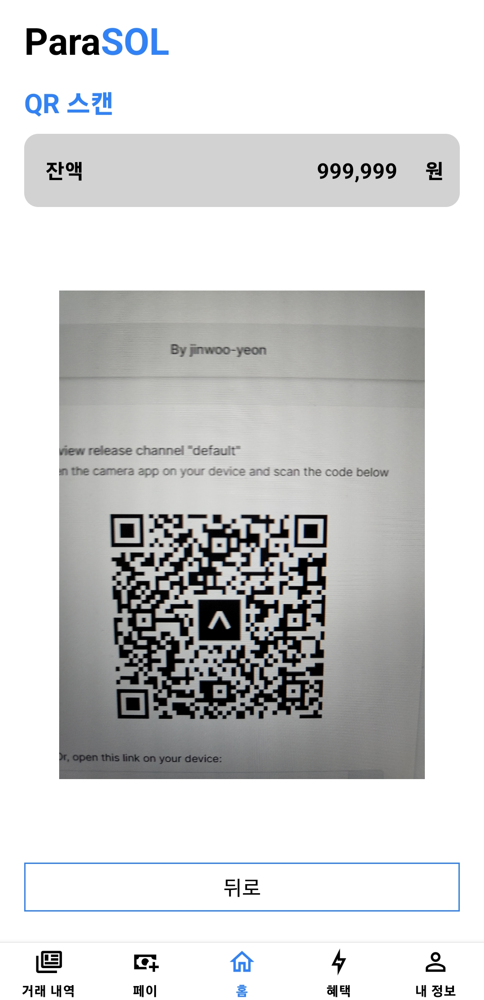 | 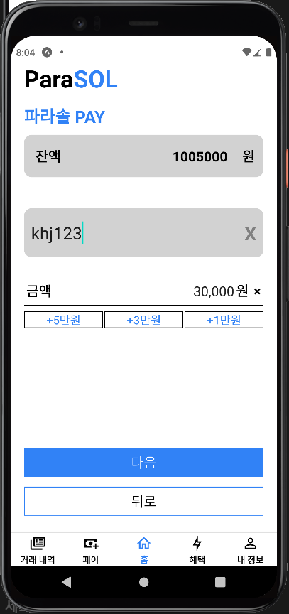 |

**혜택**

- 이벤트 목록 출력

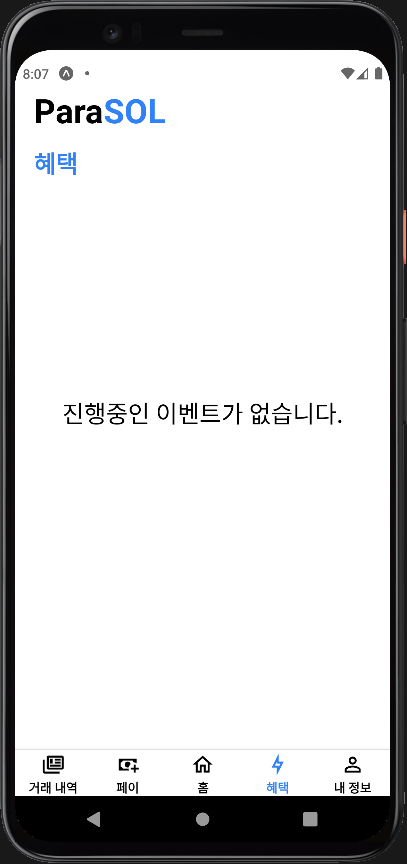

**2차인증**

- 생체 인증 - 지문 인식
- 공인 인증 - OTP
