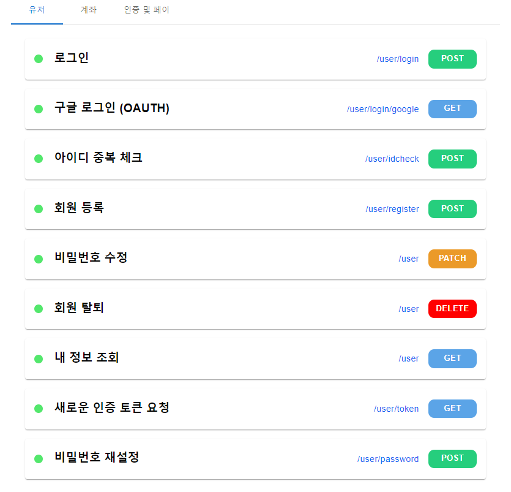
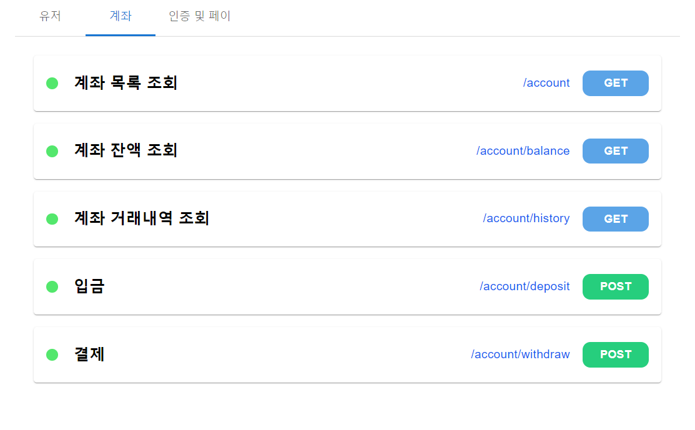
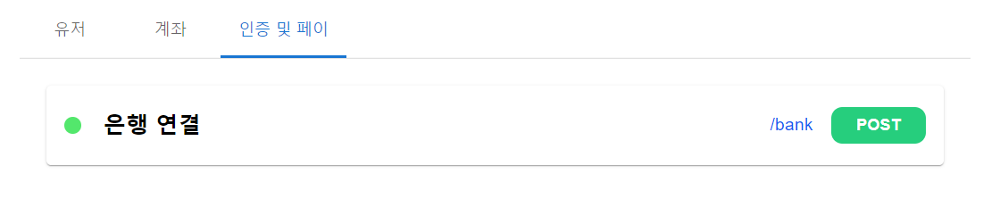
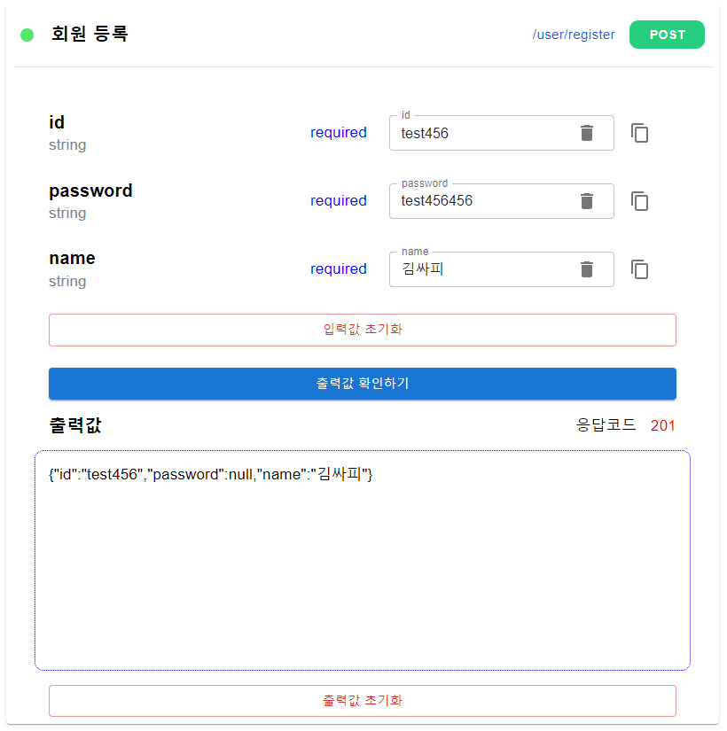
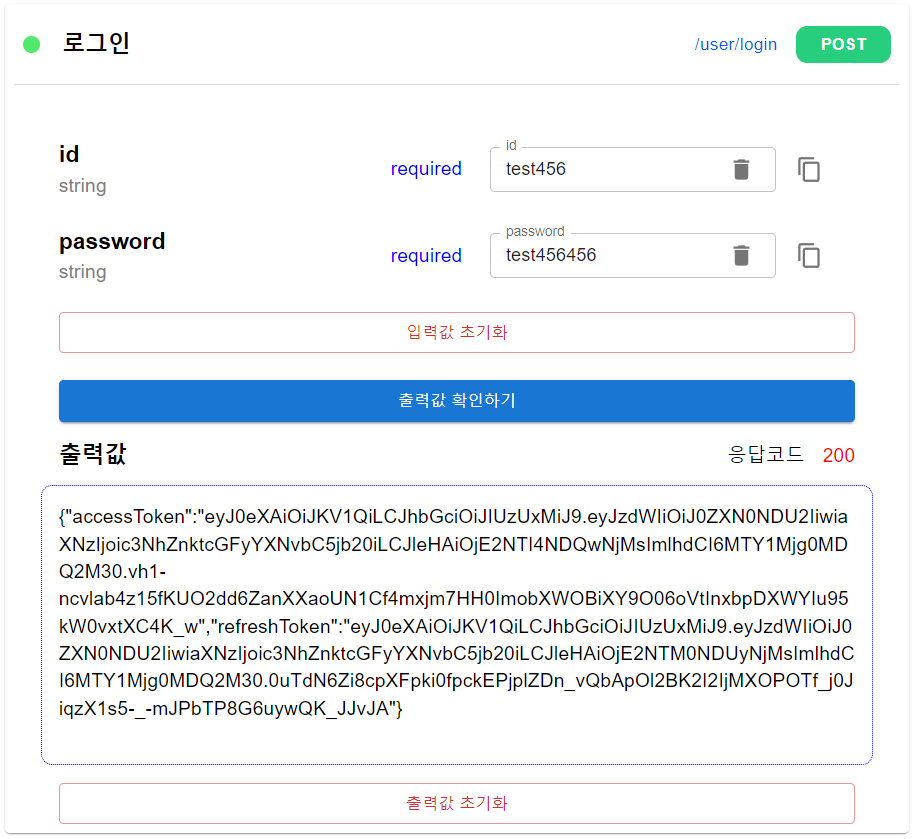
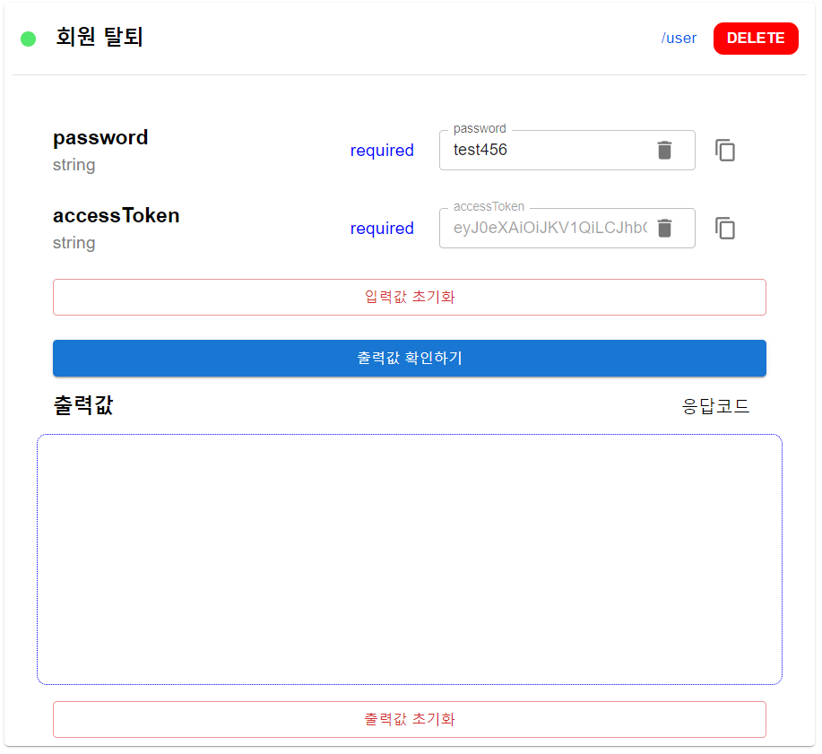
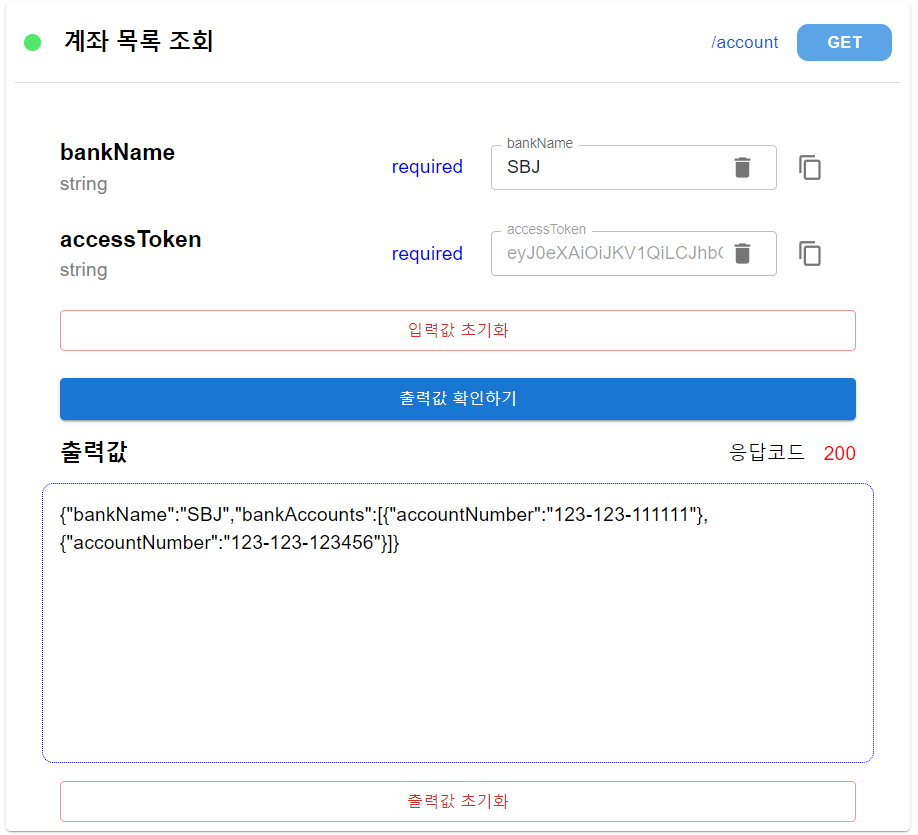
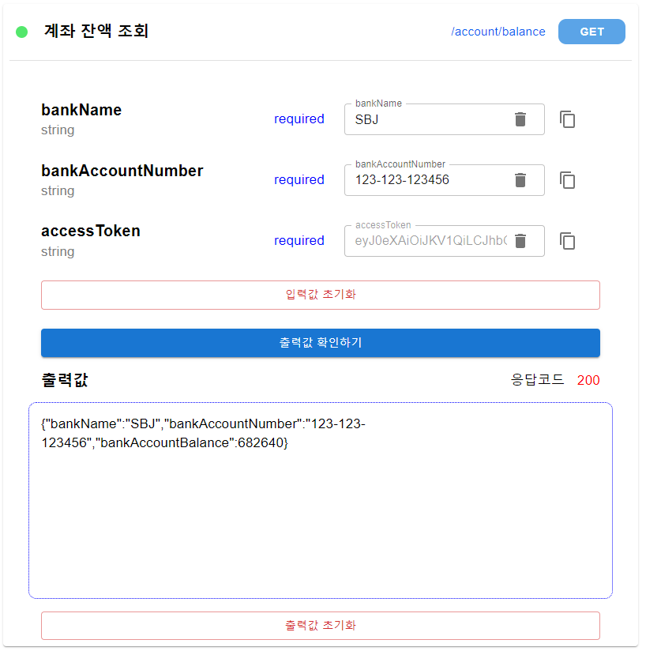

# ParaSOL Frontend Web Dashboard

## 서비스 소개

- 뱅킹 서비스 제공에 필요한 기능별로 API를 목록화하여 정의하고 구현
- API 기능별 단위 테스트를 위한 웹 대시보드
- Swagger, Postman을 모티브로 하여 레이아웃 및 디자인 설계
- API 개발 완료 여부, HTTP method, 기능명, URI 등 Rest API의 정보에 대해 쉽게 알아볼 수 있음
- 입력, 출력값과 응답 코드를 표시
- 사용자가 직접 입력하는 값과 자동으로 입력되는 값(ex. header token)을 구분

<br>

## 기술 스택

- React JS
- HTML5/CSS
- Axios
- styled components
- Material UI

<br>

## 빌드

- node pacakge manager 설치 - [Node.js](https://nodejs.org/ko/)

```bash
# npm 버전 확인
node -v

# npm 버전 확인
npm -v

# 패키지 라이브러리 설치
npm install
```

- 환경변수 설정
  - 프로젝트 최상단에 `.env` 파일 생성

```
REACT_APP_BASE_URL=https://k6S101.p.ssafy.io:8080/
REACT_APP_GOOGLE_CLIENT_ID={구글 API key}
```

<br>

## 주요 기능

**기능 별 API 목록 분류**

- 유저, 계좌, 인증 및 페이 탭

|  |  |
| ------------------------------------------------------------ | ------------------------------------------------------------ |



**입력값, 출력값 확인**

- 사용자가 직접 입력하는 데이터는 활성화
- default로 입력되는 데이터는 비활성화(ex. jwt token header)

|  |  |  |
| ------------------------------------------------------------ | ------------------------------------------------------------ | ------------------------------------------------------------ |

|  |  |
| ------------------------------------------------------------ | ------------------------------------------------------------ |

